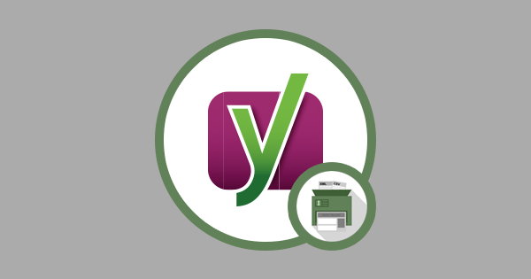

# ImportWP Yoast SEO Settings Importer

## Description

ImportWP Yoast SEO Settings Importer Addon adds extra fields to Posts, Pages, and Custom Post Types to allow for importing extra fields such as opengraph fields and images, meta description and keywords used by Yoast / WordPress SEO plugin.

## Installation

The Yoast SEO Settings Importer Addon can currently only be installed by downloading from [github.com](https://github.com/jcollings/importwp-yoast-seo) via the Releases tab of the repository.

1. Download the latest version via the [Releases page on github](https://github.com/jcollings/importwp-yoast-seo/releases).
1. Upload ‘importwp-yoast-seo’ to the ‘/wp-content/plugins/’ directory
1. Activate the plugin through the ‘Plugins’ menu in WordPress
1. A new tab should now appear labelled “Yoast” when editing an importer.

## Frequently Asked Questions

## Screenshots

## Changelog